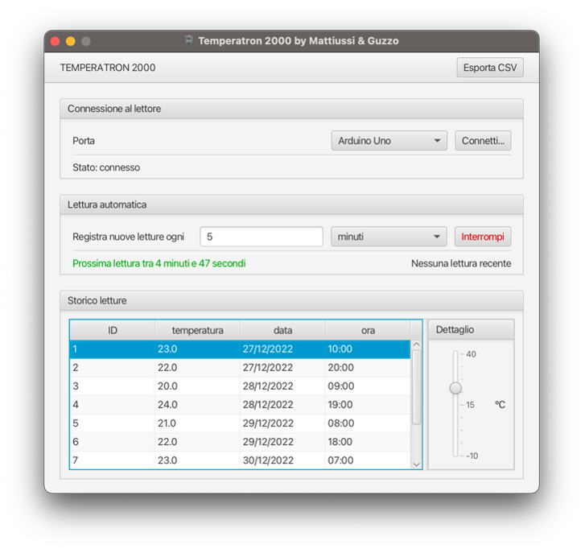

# Temperatron2000

Progetto scolastico svolto nel quarto anno di Istituto Tecnico Informatico in ambito TPSIT (Tecnologie e Progettazione di Sistemi Informatici e Telecomunicazioni)

## Di cosa si tratta

Questo programma nasce dal frutto delle competenze acquisite sia in ambito informatico che elettronico: da una parte è stato realizzato un applicativo in Java, dall'altra è stato realizzato un sensore di temperatura utilizzando un circuito composto da un termistore, a sua volta collegato ad Arduino. La semplice necessità di registrare la cronologia relativa della temperatura ambientale si è espansa nell'attento contatto con ognuna delle parti coinvolte nel processo.

Inclusi nella trasversalità degli argomenti trattati: 

* Costruzione di circuiti elettronici;
* Comunicazione seriale;
* Elaborazione di basi di dati;
* Costruzione di interfacce grafiche;

## Obiettivo

Il programma realizzato si occupa di svolgere tre attività principali: connettersi tramite porta seriale ad Arduino; ottenere da questo un valore di temperatura; registrare questo valore in un database. Tutto il programma ruota attorno a queste tre attività. Nell’interfaccia grafica si è scelto di racchiudere ogni attività in un riquadro e posizionare questi riquadri in ordine di esecuzione: connessione, lettura, visione.

## Funzionalità

* Loop di lettura: è possibile impostare un intervallo temporale che intercorre tra una lettura e quella successiva, automatizzando il processo di acquisizione;

* Storico delle letture: il programma include una piccola tabella che indica le informazioni sulla temperatura registrata, con la relativa data e ora di lettura;

* Esportazione nel formato CSV: i dati sono salvati in un database interno al programma, ma si vuole comunque offrire all’utente la possibilità di esportare e manipolare questi dati a proprio piacimento;

## Documentazione

La documentazione strutturata secondo gli standard javadoc è consultabile nella sezione apposita del progetto.

Nella cartella "flowcharts" si trova una serie di diagrammi di flusso che illustrano graficamente le principali routine del programma, questi diagrammi sono stati inizialmente concepiti come parte della relazione fornita al docente.

## Dipendenze

* Ambienti di sviluppo e progettazione

    * Eclipse IDE for Java Developers
    * Visual Studio Code + Java Extension Pack
    * Scene Builder

* Compilazione (JDK) ed esecuzione (JRE)

    * JRE 17
    * JDK 12

* Librerie esterne utilizzate

    * JavaFX 19
    * jSerialComm 2.9.2
    * opencsv 5.7.1
    * SQLite JDBC 3.39.4.0
